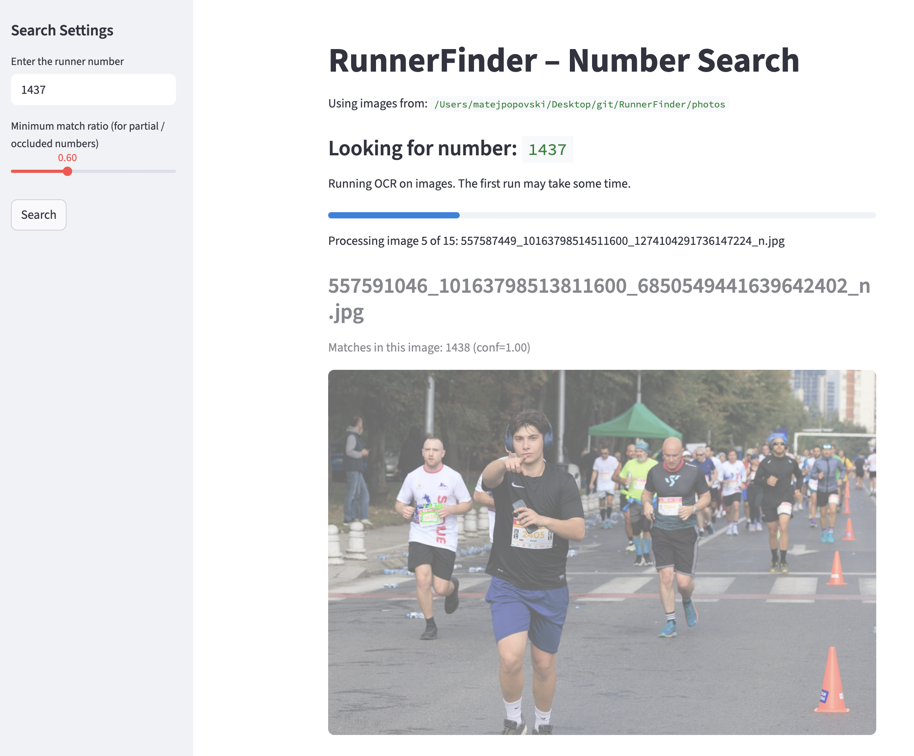
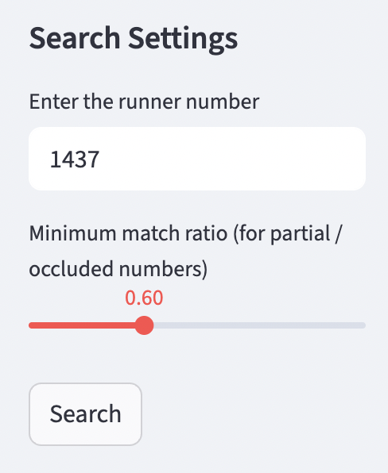
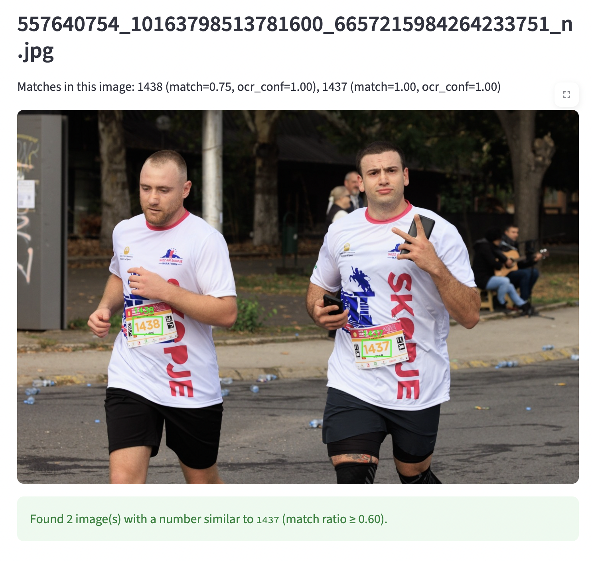

# RunnerFinder – Marathon Number Search

RunnerFinder is a Python + Streamlit app that scans marathon photos and finds runners by their **number (bib)**.  
Given a folder of race photos and a target number, the app:

1. Runs OCR on every image.
2. Extracts all digit strings.
3. Computes how similar each detected number is to the target (using a fuzzy **LCS match ratio**).
4. Highlights all matches in the images and shows them in an interactive web interface.

---

### Search example: runner 1437 (with progress bar)

While scanning the photo folder, the app shows the current image being processed, a progress bar, and the configured search settings in the sidebar.



---

### Search settings sidebar

The left sidebar lets the user:

- Enter the runner number they are looking for.
- Adjust the **minimum match ratio** (how strict matching should be for partially visible / occluded numbers).
- Start the search.



---

### Result view: multiple matches in one image

Here the app finds both `1437` and `1438` in the same photo.  
For each detected number it shows:

- The detected digits.
- The **match ratio** relative to the requested number.
- The OCR model’s own confidence.

Bounding boxes are drawn around all matches.



---

### Search example: runner 183

This screenshot shows RunnerFinder searching for runner number `183` with a minimum match ratio of `0.65`.  
Several images with numbers that partially match `183` (e.g., `103`, `1322`) are found and annotated.


---

# How to Run RunnerFinder on Your Own Computer

Below are the exact steps for any user to run the project locally.

---

## 1. Clone the repository

Copy and paste:

```bash
git clone https://github.com/<your-username>/RunnerFinder.git
cd RunnerFinder
```

## 2. Create and activate a virtual environment
 
### macOS / Linux
```bash
python3 -m venv .venv
source .venv/bin/activate
```

### Windows
```bash
python -m venv .venv
.venv\Scripts\activate

## 3. Install all dependencies
```bash
pip install -r requirements.txt
```

## 4. Add marathon photos
### Place your images inside this folder:
```bash
photos/
```

## 5. Run the web app
```bash
streamlit run app.py
```

## Project structure

Current repository layout:

```text
RunnerFinder/
├── app.py             # Main Streamlit application
├── src/               # (Reserved for reusable modules / future refactoring)
├── photos/            # Input marathon photos (user-provided)
├── output/            # Optional: where annotated images can be saved (CLI version)
├── docs/              # Screenshots used in the README
├── requirements.txt   # Python dependencies
└── README.md
